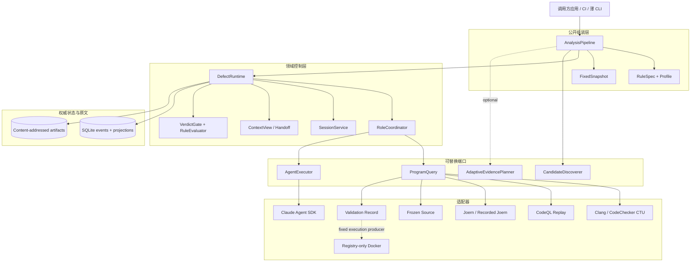
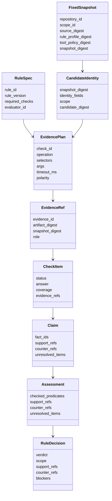
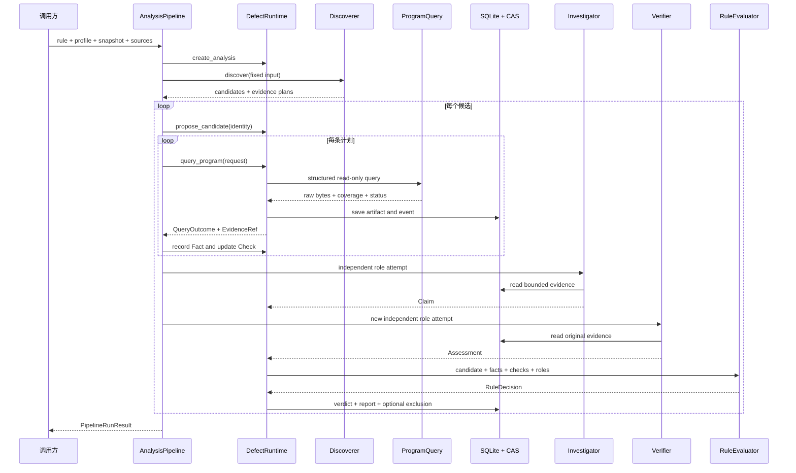

# Agent Runtime：设计架构、框架与用户指南

> 面向程序缺陷分析的 evidence-first Python Runtime。
>
> 当前版本：**0.3.0** · 文档更新：**2026-09-28** · Python：**3.10+**
>
> 本文按照“先看全局，再看架构，最后落到使用和扩展”的顺序编写。第一次接触项目时，建议先阅读第一、二、三部分；准备二次开发时，再阅读后面的组件细节与扩展契约。

## 目录

- [第一部分：先从大方向理解](#第一部分先从大方向理解)
- [第二部分：设计架构与框架](#第二部分设计架构与框架)
- [第三部分：用户怎么使用](#第三部分用户怎么使用)
- [第四部分：核心能力细化](#第四部分核心能力细化)
- [第五部分：如何扩展自己的规则和工具](#第五部分如何扩展自己的规则和工具)
- [第六部分：运行、排错和安全边界](#第六部分运行排错和安全边界)

---

# 第一部分：先从大方向理解

## 1. 一句话说明这个项目

`defect-agent-runtime` 不是一个“点击按钮就扫描所有缺陷”的成品扫描器，而是一个供其他项目引用的**缺陷分析运行时基础包**。

它把静态分析、动态复现、代码查询和 Agent 审查组织成一条可审计的流程：

```text
固定分析对象 → 发现候选 → 获取原始证据 → 独立调查与验证 → 规则裁决 → 持久报告
```

它重点解决的不是“再实现一个扫描规则”，而是下面这些工程问题：

- 分析时到底用了哪个源码版本、构建范围和工具策略；
- 工具输出是否真实保存，之后能否重新验证；
- Agent 的结论引用了哪些原始材料；
- timeout、OOM、崩溃和空结果是否被如实表达；
- 相同反例能否复用，又是否会错误影响不同版本或不同输入；
- 多种分析工具如何汇聚到统一候选、证据和裁决模型中。

## 2. 它适合谁？

| 用户 | 可以怎么用 |
|---|---|
| 代码审计平台开发者 | 把 Runtime 作为候选、Evidence、角色协同和裁决的领域控制层。 |
| 静态分析工具开发者 | 保留现有扫描器，只实现 `CandidateDiscoverer` 和只读 `ProgramQuery` 适配器。 |
| Agent 应用开发者 | 用 Claude 或其他 Agent 执行调查/验证角色，但让程序门禁掌握最终裁决。 |
| C/C++ 项目维护者 | 使用现有 Clang UAF 示例、编译数据库和可选 CTU 流程分析自己的项目。 |
| 安全研究与评测人员 | 保存可复现的动态验证记录，区分 complete、partial、timeout 和 failed。 |
| CI/质量平台 | 持久保存每次分析的快照、原始证据、覆盖、未知项和精确排除。 |

## 3. 为什么需要 Runtime，而不只是一个 Agent？

只依赖聊天式 Agent，容易把“模型认为”误当成“工具证明”。只依赖传统扫描器，又很难组合多个工具、上下文和独立验证。

本项目采用的分工是：

```text
普通程序负责确定性控制
├─ 固定源码、规则和工具策略
├─ 定义允许执行的查询
├─ 保存不可变原文
├─ 检查证据引用和覆盖
├─ 管理状态、恢复和排除
└─ 执行最终 VerdictGate

Agent 负责有限范围的推理
├─ Investigator：围绕候选调查条件
├─ Verifier：独立寻找反证和缺口
└─ Specialist：处理应用登记的专项问题
```

因此，Agent 可以帮助理解复杂代码，但不能绕过 Evidence、覆盖和规则门禁直接宣布项目安全。

## 4. 核心原则

### 4.1 Evidence first

工具原文先保存为内容寻址 Evidence，然后角色和评价器才能引用。聊天摘要不是证据。

### 4.2 Fail closed

材料缺失或执行异常时保持保守状态：

- 没跑完：`partial`；
- 超时：`timeout`；
- 隔离、OOM、输出上限或执行器失败：`failed`；
- 证据不足：`inconclusive`。

这些状态都不会自动变成“没有缺陷”。

### 4.3 精确身份

候选身份绑定固定快照和规则定义的字段。revision、源码摘要、输入、工具链、配方或 observer 不同，默认就是不同候选，不能复用旧排除。

### 4.4 Agent 可替换，领域状态不依赖 Agent SDK

核心包只依赖自己的领域对象。Claude Agent SDK 是可选适配器；其他执行器可以实现同一个 `AgentExecutor` 端口。

### 4.5 裁决与流程分离

Runtime 检查证据真实性、角色独立性和覆盖；具体缺陷是否成立，由规则自己的 `RuleEvaluator` 判断。

## 5. 当前能做什么，不能做什么？

### 已具备的能力

- 可组合的 `AnalysisPipeline`；
- 固定 `Snapshot` 和精确 `CandidateIdentity`；
- 内容寻址 Evidence、SQLite 事件和投影；
- Investigator/Verifier 独立 attempt 和 session；
- ContextView、Handoff、恢复与精确 Exclusion；
- C++ use-after-free 的 Clang/CodeChecker CTU 示例链路；
- 六类 C++ 生命周期候选扫描；
- ValidationRecord 1.0/1.1 校验与回放；
- registry-only Docker 隔离执行器；
- 固定 CodeQL、Joern、Clang、冻结源码查询适配器；
- 可选 Claude Agent SDK executor；
- 评测报告、覆盖与不确定性表达。

### 当前不是

- 覆盖所有语言和所有缺陷的一键扫描器；
- 自动证明整个项目安全的工具；
- 通用 Docker 或远程任意代码执行平台；
- 分布式工作流调度服务；
- 已发布到 PyPI 的公共包；
- 用单个 fixture 推导真实检测率的系统。

---

# 第二部分：设计架构与框架

## 6. 总体架构

项目采用“**领域内核 + 可替换端口 + 外部适配器**”的架构。Claude SDK、Clang、CodeQL、Joern、Docker 和 SQLite 都位于明确的边界上，不把它们的内部数据结构泄漏为核心领域 API。



## 7. 分层职责

### 7.1 调用方层

调用方决定：

- 分析哪个仓库、提交和范围；
- 使用哪条规则与 Profile；
- 注册哪些查询后端和执行器；
- 允许哪些工具操作；
- Evidence 和 SQLite 存在哪里；
- 什么结果可以进入 CI gate。

Runtime 不会自行扫描用户磁盘或猜测执行命令。

### 7.2 公开组装层

`AnalysisPipeline` 是大多数用户的首选入口。它把以下步骤串起来：

1. 创建 analysis；
2. 调用 discoverer；
3. 提交精确候选；
4. 执行 EvidencePlan；
5. 保存原始 Evidence；
6. 写入 Fact 和 Check；
7. 运行独立角色；
8. 调用 evaluator；
9. 生成报告。

需要完全控制事务和查询时，可以绕过 Pipeline，直接使用 `DefectRuntime` 和 `RoleCoordinator`。

### 7.3 领域控制层

| 组件 | 主要职责 |
|---|---|
| `DefectRuntime` | analysis、candidate、query、fact、check、evidence、verdict 和 report 的领域操作。 |
| `RoleCoordinator` | 按 Profile 启动独立角色，限制工具，并把异常保守转换成未完成或 inconclusive。 |
| `SessionService` | RoleAttempt、SessionBinding、租约、resume、rotate 和 handoff。 |
| `ContextViewBuilder` | 从不可变 Evidence 构建有界上下文，保留反证、未知和遗漏。 |
| `RuleEvaluator` | 将规则相关 Facts、Checks、Claim 和 Assessment 转换为裁决。 |
| 通用 VerdictGate | 验证证据引用、覆盖、角色独立性和输入摘要，不替代规则语义。 |

### 7.4 端口层

端口是第三方项目最常替换的部分：

| 端口 | 输入 | 输出 |
|---|---|---|
| `CandidateDiscoverer` | 固定 Snapshot、base/head 源码及元数据 | 候选 identity、来源和 EvidencePlan |
| `ProgramQuery` | 结构化 `QueryRequest` | `ProgramResult`、Coverage 和原始字节 |
| `AgentExecutor` | 角色、ContextView 和受限工具 | Claim、Assessment 或 SpecialistNote |
| `RuleEvaluator` | 候选、Facts、Checks、角色产物 | `RuleDecision` |
| `AdaptiveEvidencePlanner` | 待执行计划和已有结果 | 下一条 EvidencePlan 或停止 |

### 7.5 适配器层

适配器负责把外部工具转换为统一端口，示例包括：

- 冻结源码窗口；
- Clang diagnostics；
- CodeChecker/Clang CTU；
- CodeQL SARIF replay；
- Joern 固定查询或已记录结果；
- ValidationRecord 回放；
- Claude Agent SDK 角色执行；
- Docker 固定验证任务。

适配器必须明确报告覆盖、限制和失败，不得只返回“有/没有结果”。

### 7.6 存储层

首版使用：

- **SQLite**：业务事件、当前投影、任务、attempt、session、fact、check、verdict、report 和 exclusion；
- **内容寻址 artifact store**：工具原文、源码切片、日志、SARIF、validation bundle 等字节材料。

SQLite 是业务状态，artifact store 是原文。SDK 对话历史不是二者的替代品。

## 8. 框架中的核心对象



### 8.1 FixedSnapshot

固定一次分析所依赖的：

- 仓库和 scope；
- 源码摘要；
- 规则/Profile 摘要；
- 工具策略摘要；
- 可选构建或提交元数据。

Snapshot 改变后，候选和 Evidence 不能静默跨快照复用。

### 8.2 CandidateIdentity

候选不是“某文件大概有问题”，而是：

```text
规则版本 + snapshot digest + 规则定义的 identity fields + scope
```

身份不充分时只能作为 provisional candidate，不能建立可跨会话复用的永久排除。

### 8.3 EvidencePlan 和 ProgramQuery

Discoverer 声明需要哪些检查和查询。ProgramQuery 只能执行已注册的结构化 operation，例如：

- `read_source`；
- `read_clang_diagnostic`；
- `replay_codeql_result_v1`；
- `replay_validation_record_v1`。

模型不能把任意 shell、QL、数据库路径或环境变量塞进请求。

### 8.4 Fact、Check、Claim、Assessment

- **Fact**：工具原文支持的、带 polarity 的观察；
- **Check**：规则要求的问题是否完成、覆盖到什么范围；
- **Claim**：Investigator 对候选条件的结构化主张；
- **Assessment**：Verifier 对 Claim 的独立检查；
- **RuleDecision**：评价器在通用门禁下给出的最终裁决。

## 9. 一次分析是怎样运行的？



## 10. 角色与会话框架

默认角色为：

### Investigator

- 围绕一个精确候选推进；
- 阅读受限源码和 Evidence；
- 提交结构化 Claim；
- 显式列出未解决项；
- 不能直接写 Evidence 或最终 verdict。

### Verifier

- 使用独立 attempt 和 session；
- 把 Claim 当作待证伪对象；
- 直接读取原始 Evidence；
- 检查对象是否相同、路径是否覆盖、是否存在保护或遗漏；
- 输出 Assessment。

### Specialist

由应用按具体缺口配置，例如路径验证或 API 语义检查。它不会自动获得任意工具权限。

### 为什么不使用一个“总控 Agent”？

候选调度、预算、去重、重试、Evidence 保存、裁决和报告都更适合由确定性程序控制。这样可以避免聊天历史变成事实来源，也更容易恢复和测试。

## 11. 状态模型

Runtime 同时区分**执行状态**和**结论状态**。

### 执行状态

```text
pending → running → completed / partial / failed / cancelled
```

### 结论状态

```text
unassessed → confirmed / refuted / inconclusive
```

所以 `completed + inconclusive` 是合法的：流程执行结束了，但证据不足。

| 状态 | 通俗解释 | 可以得出什么结论？ |
|---|---|---|
| `confirmed` | 正证据、覆盖和独立验证均满足规则 | 只确认该 candidate identity 与 scope 下的命题 |
| `refuted` | 有完整、限定范围的反证 | 只排除完全相同的 revision/input/configuration |
| `inconclusive` | 证据不足或必要检查未完成 | 不能确认，也不能说安全 |
| `partial` | 工具只覆盖部分范围，或没有匹配到已注册结果 | 不能把零结果算作安全或真实漏报 |
| `timeout` | 查询或执行超过固定时间 | 只能说明本次执行超时 |
| `failed` | 隔离、启动、清理、OOM、输出上限或执行器失败 | 不能产生确定负证据 |
| `not_run` | 因预算或计划没有执行 | 必须保留在遗漏项或评测分母中 |

## 12. 恢复、Handoff 和 Exclusion

### 崩溃恢复

查询带幂等键。原文写入 artifact store，并在 SQLite 中提交元数据和事件后，Evidence ID 才对外可见。进程崩溃后：

- 已提交的只读查询可以复用；
- requested 但未完成的查询进入 in-doubt；
- 不会把缺失结果改写成零告警。

### Handoff

长会话轮换时，Runtime 保存结构化 Handoff：

- 已确认事实和引用；
- 反证；
- 未查项；
- 未解决假设；
- 排除范围；
- 事件水位和下一步。

原 SDK transcript 不可用时，可以从 Handoff 开新会话；未完成检查仍保持未完成。

### 精确 Exclusion

`refuted` 可以建立精确排除。只有候选 identity、快照、规则和反证依赖完全一致时才复用。代码版本或输入变化后，不会压制新候选。

---

# 第三部分：用户怎么使用

## 13. 先选择适合你的入口

| 你的目标 | 推荐入口 |
|---|---|
| 快速理解项目 | 运行 `examples/cpp_unreachable_pipeline.py` |
| 扫描本地 C++ UAF | 运行 `examples/use_after_free_pipeline.py` |
| 已经有自己的扫描器 | 实现 `CandidateDiscoverer` + `ProgramQuery` |
| 已经有 ASan/测试记录 | 生成 `ValidationRecord` 1.1 并回放 |
| 需要模型参与审查 | 安装 `[claude]` 并配置 `ClaudeAgentExecutor` |
| 需要固定 CodeQL 信号 | 准备预建 DB，使用 `CodeQLReplayProgramQuery` |
| 需要完整控制 Runtime | 直接使用 `DefectRuntime` + `RoleCoordinator` |
| 只想验证记录完整性 | 使用 `defect-validation-record` CLI |

## 14. 安装

### 14.1 从仓库开发安装

```bash
git clone https://github.com/ChenLiJie626/Agent-Runtime.git
cd Agent-Runtime

python3 -m venv .venv
source .venv/bin/activate
python -m pip install -e .
```

确认安装：

```bash
python - <<'PY'
from importlib.metadata import version
import agent_runtime

print(version("defect-agent-runtime"))
print(agent_runtime.__file__)
PY
```

预期版本为 `0.3.0`。

### 14.2 其他项目固定 Git commit

当前尚未发布到 PyPI。建议在目标项目的 `requirements.txt` 中固定 0.3.0 发行基线 commit：

```text
defect-agent-runtime @ git+https://github.com/ChenLiJie626/Agent-Runtime.git@3176c434fcc1ee0cca67664dd83a4cc99bcf84fd
```

```bash
python -m pip install -r requirements.txt
```

不要长期依赖浮动的 `main`；升级时显式修改 commit，并重新运行目标项目的验收。

### 14.3 使用 wheel

```bash
uv build --offline --out-dir dist/runtime
python -m pip install \
  dist/runtime/defect_agent_runtime-0.3.0-py3-none-any.whl
```

### 14.4 安装 Claude 可选依赖

```bash
python -m pip install \
  'defect-agent-runtime[claude] @ git+https://github.com/ChenLiJie626/Agent-Runtime.git@3176c434fcc1ee0cca67664dd83a4cc99bcf84fd'
```

核心包本身不要求 Claude SDK。

## 15. 三分钟体验

### 15.1 运行最小流水线

```bash
python examples/cpp_unreachable_pipeline.py
```

该例比较两份内存中的 C++ 源码，发现 `return` 后的语句，保存源码 Evidence，再运行确定性的调查/验证角色。

输出类似：

```json
{
  "analysis_id": "...",
  "candidates": [
    {
      "status": "inconclusive",
      "blockers": [
        "semantic_validation lacks complete scoped coverage"
      ]
    }
  ]
}
```

`inconclusive` 是正确结果：源码文字证明了“语句位于 return 后”，但没有完整语义后端证明所有控制流前提，Runtime 不会假装已确认缺陷。

### 15.2 运行仓库自带的真实 C++ UAF 示例

本机需要 `clang++`：

```bash
python examples/use_after_free_pipeline.py
```

故意缺陷夹具应产生一个 `confirmed` 候选。默认输出：

```text
.poc/use-after-free-runtime/
├── artifacts/
├── runtime.sqlite3
└── result.json
```

## 16. 分析自己的 C++ 项目

### 16.1 无编译数据库的简单项目

```bash
python examples/use_after_free_pipeline.py \
  --project /absolute/path/to/your-cpp-project \
  --output /absolute/path/to/your-cpp-project/.analysis/uaf
```

这适合依赖较少、使用默认编译选项的项目。

### 16.2 推荐：提供 compile_commands.json

真实项目通常包含 include、宏和语言选项，应先导出编译数据库：

```bash
cmake -S /absolute/path/to/your-cpp-project \
      -B /absolute/path/to/your-cpp-project/build \
      -DCMAKE_EXPORT_COMPILE_COMMANDS=ON

python examples/use_after_free_pipeline.py \
  --project /absolute/path/to/your-cpp-project \
  --compile-commands /absolute/path/to/your-cpp-project/build/compile_commands.json \
  --output /absolute/path/to/your-cpp-project/.analysis/uaf
```

查看结果：

```bash
python -m json.tool \
  /absolute/path/to/your-cpp-project/.analysis/uaf/result.json
```

重点字段：

- `diagnostic_count`：Clang 原始诊断数量；
- `candidates[].status`：最终候选状态；
- `candidates[].supporting_evidence_ids`：支持结论的 Evidence；
- `candidates[].blockers`：为什么还不能下确定结论；
- `report.candidate_reports[].checks[].coverage`：每项检查的实际覆盖范围；
- `report.unresolved_scope`：仍未覆盖或无法确认的范围。

### 16.3 跨翻译单元 CTU

缺陷跨多个 `.cpp` 时，可使用 CodeChecker/Clang CTU：

```bash
docker build -t agent-runtime/clang-ctu:clang14-codechecker6291 \
  evaluation/builds/clang-ctu-codechecker

python examples/use_after_free_pipeline.py \
  --project /absolute/path/to/your-cpp-project \
  --compile-commands /absolute/path/to/your-cpp-project/build/compile_commands.json \
  --ctu \
  --output /absolute/path/to/your-cpp-project/.analysis/uaf-ctu
```

CTU 失败、超时或只覆盖部分翻译单元时，报告会保留 partial/失败信息，不把零候选解释为安全。

## 17. 在自己的 Python 应用中嵌入

下面的例子展示完整框架组装，但只使用内存源码和包内确定性组件：

```python
from pathlib import Path

from agent_runtime import (
    AnalysisPipeline,
    CppUnreachableDiscoverer,
    CppUnreachableEvaluator,
    DefectRuntime,
    EvidenceReviewExecutor,
    FixedSnapshot,
    SQLiteStore,
    analysis_profile_digest,
    cpp_unreachable_profile,
    cpp_unreachable_rule,
    digest,
)
from agent_runtime.adapters import FrozenSourceProgramQuery

base = {"src/demo.cpp": "int f() { return 0; }\n"}
head = {
    "src/demo.cpp": """int f() {
  return 0;
  do_work();
}
"""
}

rule = cpp_unreachable_rule()
policy_digest = digest({"operations": ["read_source"], "max_lines": 200})
profile = cpp_unreachable_profile(policy_digest)
snapshot = FixedSnapshot(
    "my-team/my-project",
    "change-123",
    FrozenSourceProgramQuery.source_digest(head),
    analysis_profile_digest(rule, profile=profile),
    policy_digest,
    {"base_commit": "abc", "head_commit": "def"},
)

state = Path(".analysis/runtime")
state.mkdir(parents=True, exist_ok=True)
store = SQLiteStore(state / "runtime.sqlite3", state / "artifacts")
try:
    result = AnalysisPipeline(
        DefectRuntime(store),
        rule=rule,
        profile=profile,
        discoverer=CppUnreachableDiscoverer(),
        backend=FrozenSourceProgramQuery(snapshot, head),
        evaluator=CppUnreachableEvaluator(),
        executor=EvidenceReviewExecutor(),
        owner_id="local-worker",
        working_dir=str(state.resolve()),
    ).run(snapshot, base_sources=base, head_sources=head)

    for candidate in result.candidates:
        print(candidate.candidate_id, candidate.status)
        if candidate.decision:
            print("blockers:", candidate.decision.blockers)
finally:
    store.close()
```

这个例子对应架构中的八个步骤：

1. Rule 定义必查项和 evaluator；
2. Profile 定义角色和允许操作；
3. Snapshot 固定源码与策略；
4. Discoverer 发现候选；
5. ProgramQuery 读取允许的材料；
6. Runtime 保存 Evidence、Fact 和 Check；
7. Executor 提供角色产物；
8. Evaluator 和通用门禁输出裁决。

## 18. 校验和回放 ValidationRecord

### 18.1 CLI 校验

CLI 只读取和验证记录，不执行目标命令：

```bash
# 验证 record 结构并打印 record ID
defect-validation-record validate record.json

# 同时验证 record 引用的全部内容寻址 artifact
defect-validation-record validate record.json --artifact-root ./cas

# 输出规范化记录
defect-validation-record inspect record.json --artifact-root ./cas
```

artifact store 布局：

```text
cas/<sha256前两位>/<完整sha256>
```

### 18.2 Record 能绑定什么？

ValidationRecord 1.1 可以绑定：

- source、tool policy、toolchain、dependency 和 recipe；
- test input、binary、stdout、stderr 和额外 artifact；
- isolation probe 与 runtime report；
- build/execution termination；
- wall、CPU、memory、pids、output 和 writable bytes；
- limitations 和 omissions。

schema 1.1 进入 `RecordedValidationProgramQuery` 时必须提供 artifact root，并在构造和每次查询时重新验证。

## 19. 使用 Claude 角色

```python
from agent_runtime.adapters import ClaudeAgentExecutor, ClaudeConfig

executor = ClaudeAgentExecutor(ClaudeConfig(
    working_dir="/absolute/path/to/frozen-workspace",
    backend_id=backend.backend_id,
    backend_version=backend.backend_version,
    tool_policy_digest=snapshot.tool_policy_digest,
    model="claude-sonnet-5",
    max_turns=12,
    role_timeout_seconds=120,
))
```

接入时要注意：

- 每个角色 attempt 使用独立 session；
- Verifier 不复用 Investigator 的整个聊天历史；
- Agent 只看到 Runtime 暴露的查询和 Evidence 读取工具；
- `setting_sources=[]` 隔离用户和目标仓库设置；
- 模型和 SDK 失败会保守落到 inconclusive/failed 路径；
- 在目标环境使用前，应验证 SDK、CLI、模型和网关组合。

---

# 第四部分：核心能力细化

## 20. AnalysisPipeline 与低层 API

### AnalysisPipeline：推荐给大多数应用

优点：

- 统一 discovery、evidence plan、角色和 verdict；
- 自动持久候选来源和计划选择；
- 支持候选预算；
- 未执行候选保留为 `not_run`；
- 可注入 adaptive planner。

### DefectRuntime：推荐给平台和高级集成

适合：

- 自己管理候选批次和队列；
- 自己决定何时写 Fact/Check；
- 自定义重试和恢复策略；
- 分阶段接入多个外部系统；
- 直接构建报告和读取排除。

调用方不应绕过 Runtime 直接修改 SQLite 表。

## 21. Candidate Portfolio 与 provenance

`PortfolioDiscoverer` 可以组合多个 discoverer：

- 只按精确 candidate digest 融合；
- 保存所有来源，而不是只保留第一个；
- 来源顺序和去重保持确定性；
- provenance 绑定 analysis，重开 SQLite 后仍保留。

这适合同时组合文本规则、Clang、CodeQL 或项目自定义扫描器。

## 22. Evidence Planner

默认 Pipeline 使用固定 eager 顺序。调用方也可以提供 `AdaptiveEvidencePlanner`：

- 根据已有 QueryOutcome 选择下一条计划；
- 停止时持久保存原因和剩余计划；
- 不能选择未登记的计划；
- 未执行检查继续保持未完成。

Planner 只决定“下一步查什么”，不能伪造结果或直接完成检查。

## 23. ProgramQuery 适配器

### FrozenSourceProgramQuery

- 输入是 `{仓库相对路径: UTF-8 文本}`；
- 构造时复制输入；
- 只读取有限源码窗口；
- 拒绝 traversal 和跨快照读取；
- `complete` 只表示文字窗口完整，不表示程序语义完整。

### ClangDiagnosticProgramQuery

- 读取固定 Clang 分析 bundle；
- 绑定编译器版本、命令 profile 和 compile database；
- 保存诊断原文和源码位置；
- 可与 FrozenSource 后端组合。

### CodeQLReplayProgramQuery

- 只运行包内固定 query；
- 只接受预注册 result ID；
- canonical database 不原地 analyze；
- 每次复制到 fresh scratch；
- 绑定 query、pack、lock、compiled query、DB 和 toolchain digest；
- SARIF URI 必须归一化到 capture source root；
- 空结果保持 `partial`。

### JoernProgramQuery / RecordedJoernProgramQuery

提供固定、受限的函数、caller、guard、argument、value trace 和 reachability 查询，或者回放已保存材料。模型不能提交任意 Joern DSL。

### RecordedValidationProgramQuery

只按注册 record ID 回放完整 validation evidence bundle。schema 1.1 每次查询都会重验外部 artifact。

### CompositeProgramQuery

将 operation 不冲突的多个只读后端组合成一个后端，方便角色在同一候选中查询源码和诊断。

## 24. DockerValidationExecutor

这是受控的验证生产器，而不是一般 shell runner。

调用面只接受：

```text
suite_id + attempt_id + artifact_store
```

应用预先登记：

- image digest；
- 固定 recipe；
- source/runner 输入；
- limits；
- observer contract；
- 声明输出。

调用者不能传入 command、argv、env、cwd、image、mount 或 Docker flags。

固定隔离包括：

- `--network=none`；
- 只读根；
- UID/GID 65532；
- `--cap-drop=ALL`；
- `no-new-privileges`；
- pids、memory、memory-swap、CPU 和 ulimit；
- 只读 source/runner mounts；
- 有界 `/tmp` 与 `/work` tmpfs；
- 有界 stdout/stderr 和 wall deadline；
- named container inspect、kill 和 remove。

Docker、镜像或隔离探针不可用时 fail closed，不回退宿主执行。

## 25. ValidationRecord 的保守映射

| 执行事实 | ProgramQuery 状态 |
|---|---|
| 隔离通过、构建成功、执行完整、目标观察匹配 | `complete` |
| no-trigger 或 not-run | `partial` |
| timeout | `timeout` |
| OOM、output-limit、launch/cleanup/isolation/executor failure | `failed` |

`optimized_completed` 之类观察是否能形成 scoped negative，由应用规则评价器决定，不由通用 Record 层决定。

## 26. C++ 生命周期能力

当前内置或随附的 C++ 能力包括：

- Clang use-after-free diagnostics；
- CodeChecker/Clang CTU；
- 容器引用失效；
- 协程局部对象逆序析构；
- 异步成员逆序析构；
- returned resource ownership；
- stack-context escape；
- vector-field-copy；
- ASan evidence checklist 和规范化。

候选规则与 ASan 确认是两个阶段。只有同一 sanitizer 报告块包含匹配类型和候选源码编号栈帧时，才可形成对应的确定正证据。

## 27. 存储、事件和报告

### SQLite 业务状态

包括但不限于：

- analyses；
- candidate tasks；
- facts 和 checks；
- query requests/outcomes；
- evidence metadata；
- role attempts 和 session bindings；
- claims 和 assessments；
- verdicts 和 exclusions；
- handoffs 和 reports；
- provenance 和 planner selections。

### 内容寻址原文

artifact 由 SHA-256 标识。读取时核对摘要和大小；损坏或 symlink 会被拒绝。

### 报告关注点

不要只看 confirmed 数量，还应读取：

- `discovered_denominator`；
- `completed_count`；
- `candidate_reports`；
- `unresolved_scope`；
- `tool_failures`；
- `usage.status`；
- 每项 check 的 coverage 和 omissions。

---

# 第五部分：如何扩展自己的规则和工具

## 28. 扩展框架概览

一个完整的第三方规则通常包含：

```text
RuleSpec
├─ required CheckDefinitions
├─ evaluator identity
└─ rule version

Profile
├─ Investigator / Verifier / Specialists
├─ 每个角色允许的 operations
└─ 工具策略 digest

CandidateDiscoverer
├─ CandidateIdentity
├─ DiscoveryOrigin
└─ EvidencePlans

ProgramQuery
├─ operation schema
├─ fixed backend identity/version
├─ raw bytes
└─ Coverage

RuleEvaluator
└─ deterministic RuleDecision
```

完整包外样例见 [`examples/external_consumer.py`](examples/external_consumer.py)。

## 29. 实现 CandidateDiscoverer

Discoverer 的职责：

- 只读取固定 `DiscoveryInput`；
- 生成稳定、规范化的 candidate identity；
- 声明 candidate scope；
- 保留发现来源；
- 为 required checks 生成有界 EvidencePlan。

Discoverer 不应：

- 直接写 Runtime 数据库；
- 把候选当成 confirmed；
- 使用未绑定的宿主工作区；
- 隐藏超过预算而未执行的候选。

## 30. 实现 ProgramQuery

后端至少声明：

```python
backend_id = "my-company.symbol-index"
backend_version = "1"
supported_operations = frozenset({"inspect_symbol"})
read_only = True
idempotent_retry = True
```

并为每个 operation 提供固定参数 schema。`query()` 返回：

- `ProgramResult.status`；
- `Coverage`；
- 有界 raw bytes；
- limitations 或 diagnostic。

完整覆盖的 `Coverage.basis_refs` 应绑定原文字节摘要。不要把异常吞掉后返回空成功。

## 31. 实现 RuleEvaluator

Evaluator 负责规则语义，而不是通用流程。它应检查：

- Facts 是否属于当前 task 和 check；
- polarity 是否符合规则；
- EvidenceRef 是否真实存在；
- required checks 是否完整；
- Claim/Assessment 是否仍有 unresolved items；
- 作用域是否与 candidate 相同；
- `decision_input_digest(...)` 是否覆盖完整输入。

Evaluator 不能引用不存在的 Evidence；Runtime 的通用门禁会拒绝 fabricated refs 和 partial evidence 上的确定 verdict。

## 32. 实现 AgentExecutor

Executor 声明能力：

- structured output；
- explicit resume；
- isolated session；
- custom tools；
- stream、interrupt 和 usage reporting 是否真实支持。

Profile 要求的能力在 attempt 启动前检查。能力缺失时应显式失败，不能假装已经执行角色。

测试和离线场景可以使用确定性的 `EvidenceReviewExecutor`。真实 Agent 可以使用 `ClaudeAgentExecutor` 或第三方实现。

## 33. 版本和兼容建议

- 只从 `agent_runtime` 和明确列出的 `agent_runtime.adapters` 导入；
- 不依赖 SQLite 表和内部 `_` 符号；
- 固定包 commit 或 wheel SHA；
- 持久 schema 与包版本分别管理；
- 当前业务事件 envelope 读取 1.0/1.1，写入 1.1；
- ValidationRecord 1.0 canonical bytes/ID 保持兼容，1.1 增加隔离和资源证据；
- 自定义 rule、backend、evaluator 和 discoverer 都要有显式版本。

---

# 第六部分：运行、排错和安全边界

## 34. 常见问题

### 为什么结果是 inconclusive？

查看：

- `candidates[].blockers`；
- required checks 是否 complete；
- Coverage 是否 complete；
- Investigator/Verifier 是否存在 unresolved items；
- 工具是否返回 partial/timeout/failed；
- 当前后端是否只能证明文字而不能证明程序语义。

### 为什么零结果不是 refuted？

零结果可能意味着：

- 查询没有覆盖目标；
- build 或 index 不完整；
- result ID 没有注册；
- 规则本身只产生候选信号；
- 工具超时或失败；
- 输入没有触发目标路径。

只有规则定义的完整 scoped negative 才能成为 refuted。

### 为什么旧排除没有复用？

检查 candidate identity 中是否有变化：

- snapshot/revision；
- source digest；
- input digest；
- record ID；
- toolchain；
- recipe；
- observer contract；
- rule version。

这是预期的安全行为。

### 为什么 CLI 不能直接运行 record？

`defect-validation-record` 故意只有 `validate` 和 `inspect`。执行入口若接受任意 argv，会把只读 Evidence 包变成远程执行面。固定执行必须由应用登记的隔离 executor 完成。

## 35. 错误分类

调用方可以依赖这些公开异常类别，而不应依赖具体文本：

| 异常 | 含义 |
|---|---|
| `InvalidInput` | 输入形状、路径、摘要或领域不变量非法 |
| `Conflict` | 幂等键或当前状态冲突 |
| `CapabilityUnavailable` | 执行器不支持 Profile 要求的能力 |
| `PolicyDenied` | 查询或工具不在允许策略中 |
| `StaleSnapshot` | 请求绑定的快照已经不匹配 |
| `EvidenceIntegrityError` | Evidence 缺失、摘要变化或内容损坏 |
| `SessionUnavailable` | session 无法 resume、租约冲突或历史不可用 |
| `BackendFailure` | 查询或执行适配器失败 |
| `StorageFailure` | SQLite 或 artifact store 失败 |

## 36. 安全建议

- 固定源码、工具链、镜像和 package commit；
- 外部下载先验证 size/SHA，再安全解包；
- 不执行上游 hook 或脚本来“准备证据”；
- ProgramQuery 保持只读和结构化；
- 不允许模型提供 shell、QL、database path、mount、env 或 Docker flags；
- 动态验证使用禁网、非 root、只读根和资源上限；
- 原始 stdout/stderr/SARIF 做大小限制；
- Evidence artifact 每次读取都验证摘要；
- 不把凭据、`.poc/`、database、SARIF、SQLite 或 raw logs 提交到 Git；
- CI gate 同时检查 verdict、coverage、tool failures 和 unresolved scope。

## 37. 当前真实验收情况

0.3.0 已完成：

- ValidationRecord 1.1 与 1.0 兼容；
- VE-02 六个 Docker 隔离 self-test；
- cpp-peglib base/fix × ignored/ordinary 四象限；
- Runtime 结果 1 confirmed、2 scoped refuted、1 inconclusive；
- SQLite 重开 exact exclusion；
- identity 分离和 artifact tamper fail-closed；
- CodeQL 2.27.1 query compile、四个真实数据库、双跑 analyze 和 positive replay；
- pytest 203 passed、3 skipped；
- unittest 172 passed、3 skipped；
- compileall、wheel/sdist 和 checkout 外干净安装通过。

这些结果证明固定配置下的工程链路，不代表对所有真实项目的总体检测率，也不代表 cpp-peglib 或其他项目整体安全。

## 38. 下一步阅读

- [README](README.md)：项目总览、当前验证结果和常用命令；
- [SPEC 000](specs/000-runtime-kernel.md)：Runtime 内核契约；
- [SPEC 002](specs/002-domain-and-api-contract.md)：领域对象和公开 API；
- [SPEC 003](specs/003-state-events-and-recovery.md)：状态、事件与恢复；
- [SPEC 004](specs/004-adapter-capabilities-and-query.md)：适配器能力和查询边界；
- [SPEC 006](specs/006-defect-context-and-memory.md)：Context、Handoff 和排除记忆；
- [SPEC 007](specs/007-release-and-extension.md)：发行与第三方扩展；
- [SPEC 010](specs/010-reproducible-validation-evidence.md)：隔离执行和验证证据；
- [包外扩展示例](examples/external_consumer.py)：自定义规则、后端、Agent 和 evaluator；
- [C++ UAF 示例](examples/use_after_free_pipeline.py)：Clang/CTU 到 Runtime 的完整流程。

如果只记住一条原则：**先确认分析范围和 Evidence 是否完整，再看 verdict；不要只看候选数量。**
